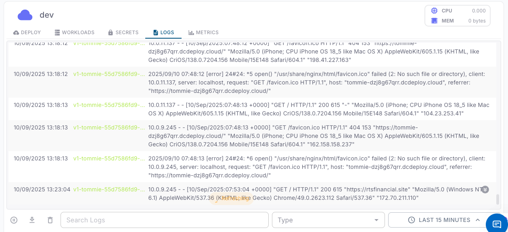

The **Logs** tab provides real-time visibility into the output of your running workloads.  
It is especially useful for debugging, monitoring application health, and investigating errors.

<Steps>
  <Step title="Log entries">
    Each log entry contains:
    - **Timestamp**: When the log line was generated.  
    - **Workload & Version**: Identifies which workload and version produced the log (e.g., `v1-tommie-...`).  
    - **Log Message**: The actual application or system output (e.g., HTTP requests, errors, warnings).  
    - **Client Details**: Includes client IP, user-agent, referrer, and request path.  
  </Step>

  <Step title="Filtering logs">
    You can narrow down the displayed logs using:
    - **Time Range**: Select a window (e.g., *Last 15 minutes*, *1 hour*, *24 hours*).  
    - **Search Box**: Enter keywords, error codes, or paths to filter relevant log entries.  
    
  </Step>

  <Step title="Exporting logs">
    Use the **download button** (⬇️) to export logs for offline analysis or sharing with your team.
  </Step>

  <Step title="Best practices">
    - Regularly monitor logs to identify unexpected errors early.  
    - Use search filters when debugging specific issues (e.g., `500`, `favicon.ico`, `POST /api/login`).  
    - Combine log analysis with the **Metrics tab** for deeper insights on performance bottlenecks.  
    - For production environments, integrate log shipping with external monitoring systems if needed.  
  </Step>
</Steps>
