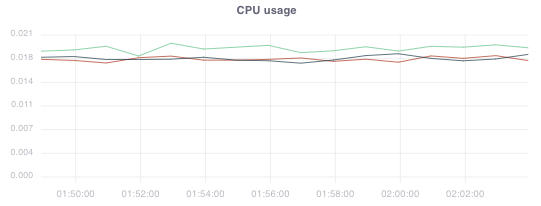
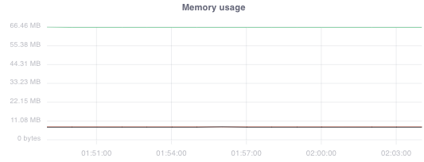
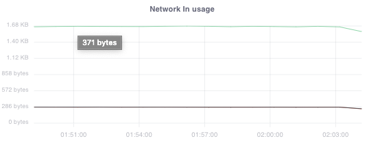
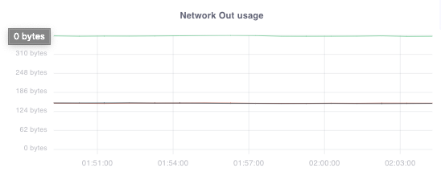
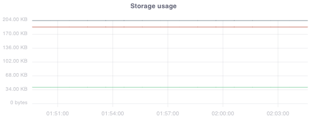

The **Metrics** tab helps you monitor workload performance in real time.  
You can track CPU, Memory, Network, Storage usage, and response errors over a selected time window.

---

## CPU Usage

Tracks how much CPU your workload is consuming over time.  
Helps you identify performance spikes or bottlenecks.

---

## Memory Usage

Displays the memory consumption of your workloads.  
Useful for detecting memory leaks or unusual memory growth.

---

## Network In Usage

Shows the amount of incoming traffic to your workloads (in bytes).  
Helps track request volume and data transfer rates.

---

## Network Out Usage

Shows the amount of outgoing traffic from your workloads (in bytes).  
Useful for monitoring external API calls or client responses.

---

## Storage Usage

Monitors how much storage your workload is consuming over time.  
Helps in preventing disk usage issues.

---

## 4xx Responses

Displays client-side errors (e.g., bad requests, unauthorized, not found).  
Helps detect incorrect API calls or misconfigured clients.

---

## 5xx Responses

Displays server-side errors (e.g., internal server errors, service unavailable).  
Useful for debugging backend or server-related issues.

---

## Features

- **Per Pod/Instance Breakdown** → Metrics per pod/instance for deeper insights.  
- **Time Range Selector** → Choose between last 15 min, 1 hr, 1 day, etc.  
- **Export & Filter** → Download or filter metrics by workload type.  

