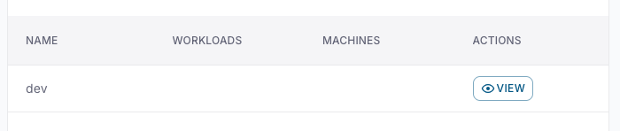
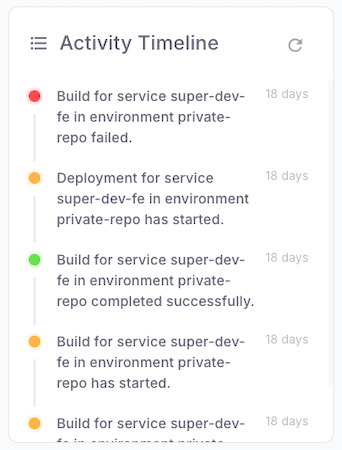
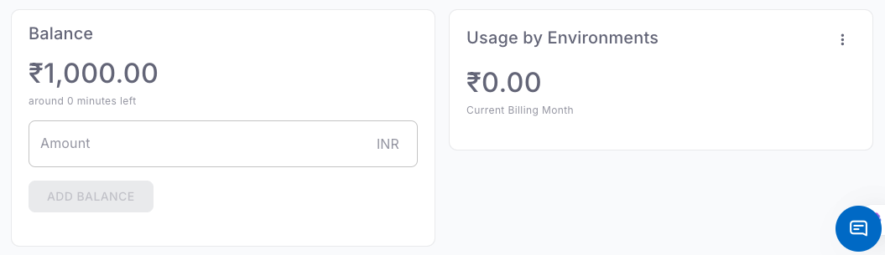

The **Organization Overview** page gives you a central view of your organization’s resources, usage, and billing in dcdeploy.  
It helps you monitor environments, manage balance, and track activities across workloads in real time.  

---

## Sections in Organization Overview

### 1. **Environments**
- Lists all active environments under the organization (e.g., `env1`, `public-repo`, `private-repo`, `db`).  
- For each environment you can:
  - View associated workloads and machines.
  - Manage deployments.
  - Access environment-specific settings.  

👉 Use the **View** button to drill into details for each environment.

---

### 2. **Activity Timeline**
- Displays recent events and deployments across environments.  
- Events include:
  - Build start & completion.  
  - Deployment progress.  
  - Failed builds (marked in red).  
- Helps track history and troubleshoot issues in real time.

---

### 3. **Balance**
- Shows your **current account balance** in INR.  
- Negative values indicate outstanding dues.  
- You can **add funds** directly from this panel.  
- Also displays estimated **minutes left** based on current balance and usage.  

---

### 4. **Usage by Environments**
- Breaks down **current month’s billing** by environment.  
- Helps identify which environment or repo consumes the most resources.  
- Example:
  - `env1` – ₹1,845.59  
  - `public-repo` – ₹9,381.05  
  - `private-repo` – ₹141.97  
  - `db` – minor usage  

---

## Key Use Cases

- Quickly monitor environment health and usage.  
- Identify high-cost environments and optimize workloads.  
- Track build and deployment history for debugging.  
- Manage balance to avoid service interruptions.  

---

## Best Practices

- Regularly check the **Activity Timeline** to spot failed builds.  
- Use **Usage by Environments** to optimize cost allocation.  
- Ensure your **balance is positive** to prevent deployment failures.  
- Organize workloads into separate environments for clarity (e.g., dev, staging, prod).  

---

## Related Topics

- [Environment Management](./environment-variables.mdx)  
- [Usage and Billing](../billing/plans-and-usage.mdx)  
- [Invoices](../billing/invoices.mdx)  