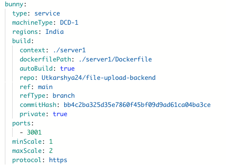
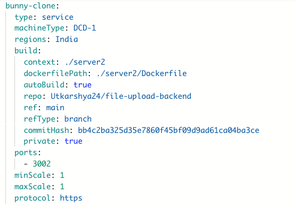

---

## When to use Clone
- **Staging and Production** → Duplicate your service and point it to a different branch or database.
- **A/B Testing** → Run two versions of the same service with small differences.
- **Quick Setup** → Save time instead of re-entering build and scaling options manually.

---

## How to clone a service

1. Go to your **Environment Dashboard** → **Deploy tab**.  
2. Select the service you want to clone (e.g., `bunny`).  
3. At the bottom of the service card, click **Clone**.  
4. A new service (`bunny-clone`) will be created with identical configuration.  
5. Update the cloned service:
   - Change **name** to avoid conflicts.  
   - Adjust **repository ref / branch / commit** if needed.  
   - Modify **ports** if both services must run simultaneously.  
   - Update **environment variables** (e.g., different API keys).  

---

## Example: Cloning `bunny`

Original service:

Cloned service:

---

## Best practices
- **Rename immediately** to avoid name conflicts.  
- **Use different ports** if both services run in the same environment.  
- **Keep configs in sync** with environment variables or secrets manager.  
- **Use cloning for speed**, but review each setting before deployment.  

---
