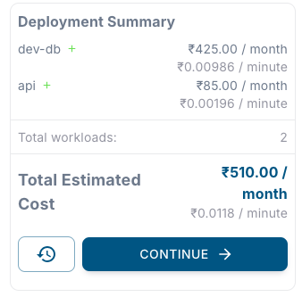

<Steps>
  <Step title="Navigate to Deploy tab">
    Go to the **Deploy** tab of the environment in your DCDeploy dashboard.  
    Here you can deploy both services and databases.  
    
  </Step>

  <Step title="Add a new database">
    Click on **Add Database**. A new form will appear where you can configure your database.
  </Step>

  <Step title="Fill in the details">
    Provide the following details:  

    - **Database Name**: Enter a unique name for your database instance.  
    - **Engine**: Select the database engine and version. Supported engines:  
      - MongoDB (v4, v5, v6, v7)  
      - MariaDB  
      - PostgreSQL  
      - MySQL  
    - **Region**: Choose the DCDeploy region where your database should be deployed.  
    - **Machine Type**: Select a machine type that fits your resource needs (CPU, RAM, Disk).  

    
  </Step>

  <Step title="Deploy">
    Click **Continue > Deploy** to start provisioning your database.  
    
    - Deployment may take a few minutes depending on the engine and machine type selected.  
    - Once deployed, connection details (hostname, port, username, password) will be available in the dashboard.  

  </Step>
</Steps>
