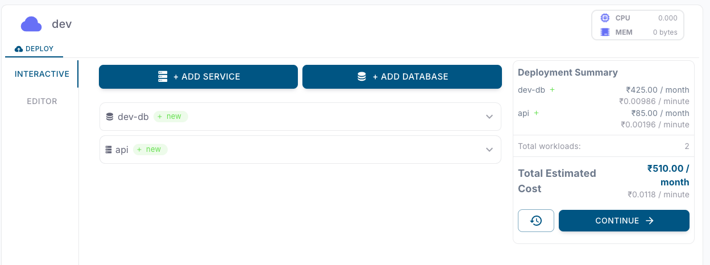
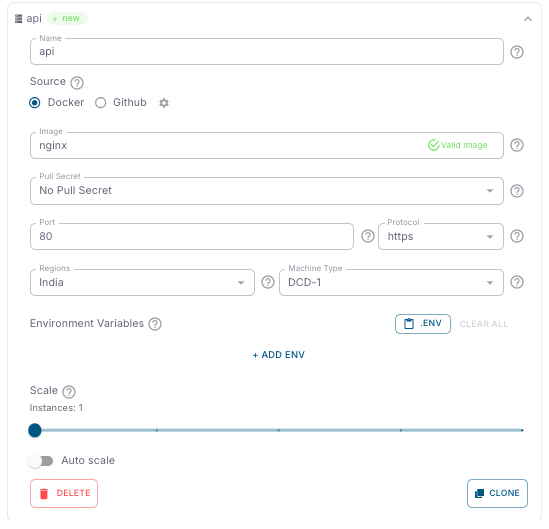
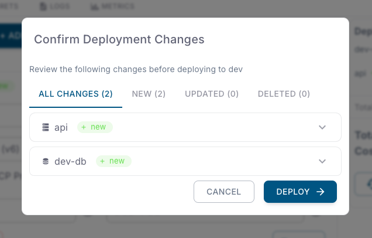

<Steps>
 <Step title="Navigate to Deploy tab">
    Navigate to the **Deploy** tab of the environment in your DCDeploy dashboard where you want to deploy your service.
    
  </Step>

  <Step title="Add a new service">
    Click on **Add Service**. A new form will appear where you can provide details of your service.
  </Step>
  <Step title="Begin Deployment">
    1. Begin by adding a new service.  
    2. **Service Name**: A unique name is auto-generated by default. You can change it if needed.  
      
  </Step>

  <Step title="Select Source and Image">
    6. Next, select the source type for your service (default is **Docker**).  
    7. Afterwards, provide the image details.  
    8. Valid examples: `nginx:latest`, `nginx`, `docker.io/nginx:latest`, `docker.io/nginx`.  
    9. Continue by adding the image configuration.  
    10. By default pull-secret set to no pull-secret if the service is private configure credentials , the service will be deployed in private network. Otherwise, it will be deployed in public network. 
  </Step>

   <Step title="Configure runtime settings">
    Configure how your service should run:
    
    - **Port**: Enter the port number your service listens on. Ensure your app binds to `0.0.0.0` on this port.  
    - **Protocol**: Choose HTTPS, or TCP depending on your service.  
    - **Region**: Select the DCDeploy region(s) where you want your service deployed.  
    - **Machine Type**: Choose from available DCDeploy machine types (CPU, RAM, and Disk). [See details here](https://dcdeploy.com/pricing/).  
    - **CPU/Memory Usage Limits**: Configure resource limits according to your service requirements.  
    - **Environment Variables**: Provide environment variables directly paste your `.env` file or add manually.  
    - **Scaling Options**:  
      - Define minimum and maximum instances.  
      - Enable **Auto Scaling** to automatically scale based on traffic or CPU/memory thresholds.  

  </Step>

  <Step title="Summary">
    Click the **Continue** button.  
     
    - You’ll be asked for confirmation before deployment.  
    - If multiple services are added, removed, or updated, confirmation will cover all changes.  

    
  </Step>
</Steps>
