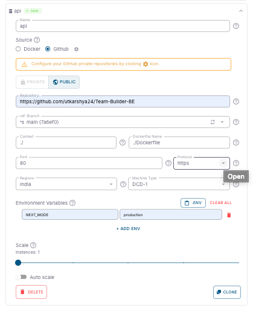

<Steps>
  <Step title="Navigate to Deploy tab">
    Navigate to the **Deploy** tab of the environment in your DCDeploy dashboard where you want to deploy your service.
    
  </Step>

  <Step title="Add a new service">
    Click on **Add Service**. A new form will appear where you can provide details of your service.
  </Step>

  <Step title="Fill in the details">
    Complete the following fields:
    
    - **Service Name**: A unique name is auto-generated by default. You can change it if needed.  
    - **Source**: Select **GitHub** as the source.  
     
    - **Repository**: Choose the GitHub repository where your code resides. You can deploy from both **public** and **private** repositories.  
    - **Branch / Tag**: Select the branch or tag you want to deploy from.  
    - **Build Context**: Provide the path in your repo where the Docker build should run (default is `./`).  
    - **Dockerfile Path**: Specify the Dockerfile path if it’s not in the root directory (default is `./`).  
    - **Auto Build (Optional)**: Enable auto-build to automatically trigger a new build whenever you push to the selected branch.  

  </Step>

  <Step title="Configure runtime settings">
    Configure how your service should run:
    
    - **Port**: Enter the port number your service listens on. Ensure your app binds to `0.0.0.0` on this port.  
    - **Protocol**: Choose HTTP, HTTPS, or TCP depending on your service.  
    - **Region**: Select the DCDeploy region(s) where you want your service deployed.  
    - **Machine Type**: Choose from available DCDeploy machine types (CPU, RAM, and Disk). [See details here](https://cloud.google.com/compute/docs/machine-types).  
    - **CPU/Memory Usage Limits**: Configure resource limits according to your service requirements.  
    - **Environment Variables**: Provide environment variables directly paste your `.env` file or add manually.  
    - **Scaling Options**:  
      - Define minimum and maximum instances.  
      - Enable **Auto Scaling** to automatically scale based on traffic or CPU/memory thresholds.  
      - **0 scaling** means no traffic = service paused (billing paused too). When requests come in, it scales up automatically (cold start period applies).  

    
  </Step>

  <Step title="Deploy">
    Click the **Deploy** button.  
    
    - You’ll be asked for confirmation before deployment.  
    - If multiple services are added, removed, or updated, confirmation will cover all changes.  

    
  </Step>
</Steps>
