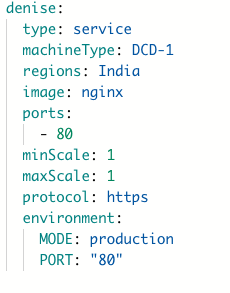
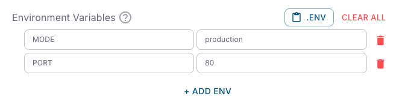

## Adding environment variables

You can define environment variables while creating or updating a deployment:

1. Go to your **Environment Dashboard** → select your service.
2. add service and add **Environment Variables**, click **Add Variable**.
3. Provide a **key** and **value**.
4. Save changes and **redeploy** for updates to take effect.

---

## Using in service manifests

You can declare environment variables directly in the service manifest (`service.DCDeploy.yaml`):


---

## Secrets management

Sensitive values (e.g., database passwords, API keys) should be stored as **secrets**. DCDeploy automatically encrypts them and injects them at runtime.

Example:


Where `MODE` is managed in the **Secrets** section of the dashboard.

---

## Overriding variables

- Variables defined in the dashboard UI override those in the manifest.
- Redeployment is required for changes to apply.
- Deleted variables are removed from the runtime environment on next deploy.

---

## Best practices

- **Never hard-code secrets** in images or code.
- **Use different env files** for dev, staging, and production.
- **Prefix variables** for clarity (e.g., `DB_HOST`, `REDIS_URL`).
- **Keep non-secret configs** (like `LOG_LEVEL`) separate from sensitive ones.

---

## Example usage in code
<CodeGroup>

```javascript helloWorld.js
const dbUrl = process.env.DATABASE_URL;
```

```python hello_world.py
import os
DB_URL = os.getenv("DATABASE_URL")
```

</CodeGroup>
