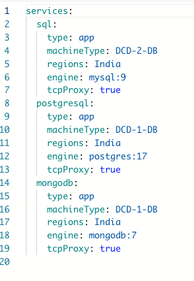
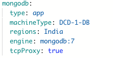
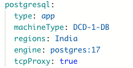
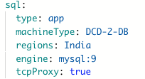

---

## When to use TCP Proxy?

-  **Databases** – Expose PostgreSQL, MySQL, or Mongodb for internal/external access.  
-  **Message Brokers** – Kafka, RabbitMQ, or custom TCP services.  
-  **Custom Protocols** – Any app or service that doesn’t use HTTP/HTTPS.  

---

## Configuration

To configure a workload with **TCP Proxy**, set the `protocol` field to `tcp` in your `DCDeploy.yml`.

- ports → The TCP port your service listens on.
- protocol: tcp → Ensures the proxy forwards raw TCP traffic instead of HTTP.
- minScale / maxScale → Defines scaling limits (usually fixed for databases).

### Example: Mongo-db with TCP Proxy
  

### TCP Public URLs for Databases
When you set protocol: tcp, DCDeploy provisions a public TCP endpoint so you can connect to your database or TCP service from anywhere.

### PostgreSQL Example

Mysql Example
   

### Best practices
- Secure your database – Never leave databases open without authentication. Always set strong passwords.
- Restrict access – Use firewall rules or allow-list IPs if possible.
- Prefer private networking – For production workloads, use DCDeploy’s private VPC or service-to-service networking instead of exposing databases publicly.
- Use secrets to store credentials rather than hardcoding them in your DCDeploy.yml.

--- 
