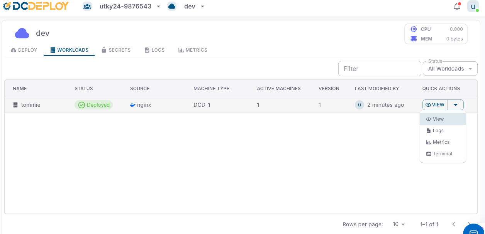

The **Workloads** tab gives you a centralized view of all the services and databases deployed within your selected environment. It provides real-time visibility into status, resources, and quick management actions.

<Steps>
  <Step title="Workload overview">
    Each workload is listed with the following details:
    - **Name**: The unique name of your service or database.  
    - **Status**: Current state of the workload (e.g., *Created*, *Accepted*, *Buiding*, *Started*, *Pulled*, *Pulling*, *Deployed*,*Failed*).  
    - **Source**: The origin of the workload (e.g., *Docker image*, *GitHub public/private repo*).  
    - **Machine Type**: The compute machine type allocated (e.g., *DCD-2*, *DCD-3*, etc..).  
    - **Active Machines**: Number of running instances for the workload.  
    - **Version**: The current deployed version.  
    - **Last Modified By**: The user who last updated the workload and timestamp of modification.  
  </Step>

  <Step title="Filtering and searching">
    Use the **Status filter** or the **search bar** to quickly locate workloads by name or status.
  </Step>

  <Step title="Quick actions">
    The **Quick Actions** dropdown (⚙️ **View**) provides shortcuts to manage each workload:
    - **View**: Inspect workload configuration and details.  
    - **Logs**: View real-time application logs for debugging and monitoring.  
    - **Metrics**: Analyze CPU, memory, and resource usage trends.  
    - **Terminal**: Access an interactive shell inside the running container for direct troubleshooting.  
  </Step>

  <Step title="Best practices">
    - Regularly check **Logs** to ensure application health.  
    - Use **Metrics** to fine-tune scaling and machine types.  
    - Keep workload versions updated to avoid stale deployments.  
    - For debugging, use the **Terminal** cautiously (production workloads should use secrets and configs instead of manual fixes).  
  </Step>
</Steps>
