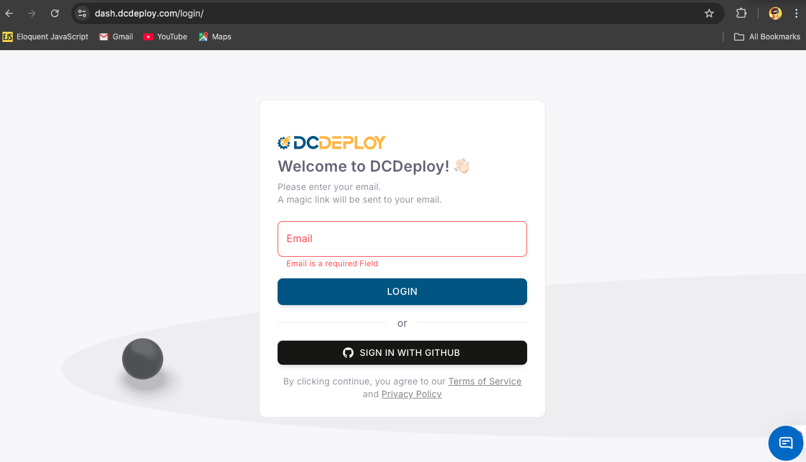
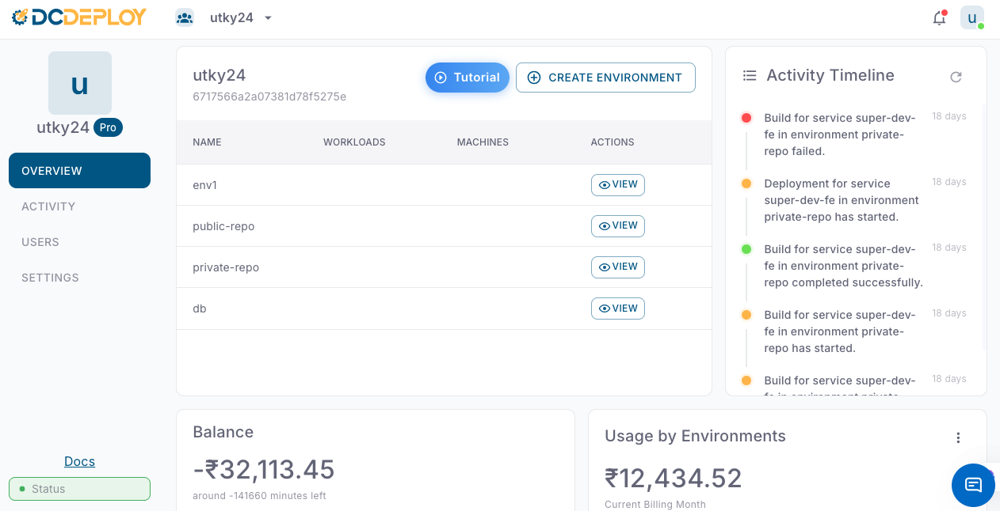
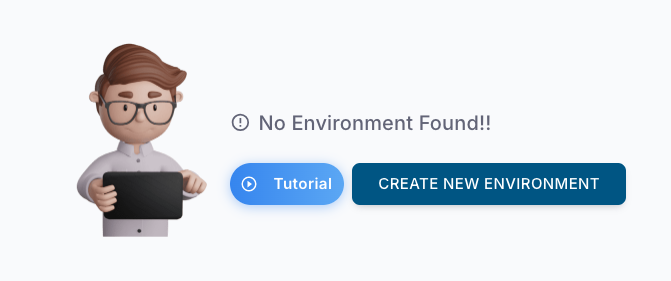
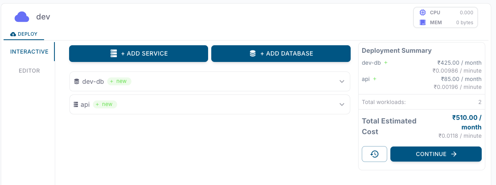
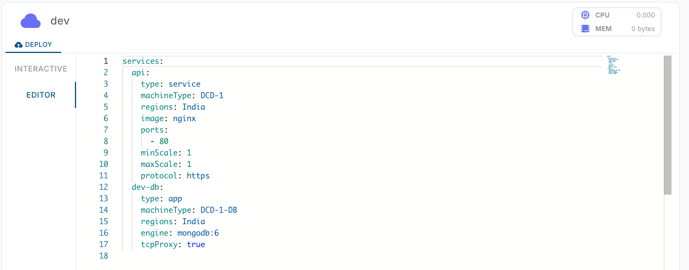

<Steps>
  <Step title="Login into dashboard">
    Firstly login into your DCDeploy dashboard using your Github account. If you're a new user, your account will be created automatically.
    
  </Step>
  <Step title="DCDeploy dashboard">
    A default organization will be created for you. All the activities, environments, billing and more is present in the dashboard.
    

    Now create a new environment. An environment can be viewed as a group of services / apps / databases which are required to run your business and will be interdependent to each other. 
    For example, you may start with Dev environment, then go to QA and then go to Prod. 
    You can create multiple environments as per your requirement.
    
  </Step>
  <Step title="Deploy">
    Deploy your services or databases. You may deploy as many service or database as you want. All these services and databases are networked together in a private wireguard vpn based networking as well as public Endpoints are also available.
    

    For advance users, a yaml editor is also available to deploy services and databases in a single click.
    
  </Step>
</Steps>
