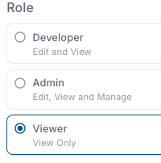

DCDeploy provides **role-based access control (RBAC)** to manage how users interact with your organization, environments, and workloads.  
This ensures secure collaboration without overexposing sensitive controls.

---

## Available Roles

### Developer
- **Permissions:** Edit and View  
- Can create, update, and deploy workloads.  
- Can view logs, metrics, and secrets.  
- Cannot manage organization-level settings or billing.  

---

### Admin
- **Permissions:** Edit, View, and Manage  
- Full control over environments and workloads.  
- Can invite or remove users.  
- Can manage billing and organization settings.  
- Can configure domains, networking, and limits.  

---

### Viewer
- **Permissions:** View Only  
- Read-only access to workloads, logs, and metrics.  
- Cannot edit or deploy workloads.  
- Suitable for stakeholders, QA, or monitoring users.  

---

## Assigning Roles

1. Go to **Organization → Users**.  
2. Click **Invite User** or edit an existing member.  
3. Choose a role: Developer, Admin, or Viewer.  
4. Save changes.  

---

## Best Practices
- Assign **Admin** only to trusted core team members.  
- Use **Developer** for active contributors working on code.  
- Give **Viewer** access to non-technical stakeholders.  
- Regularly review user roles to maintain least-privilege access.  

---
